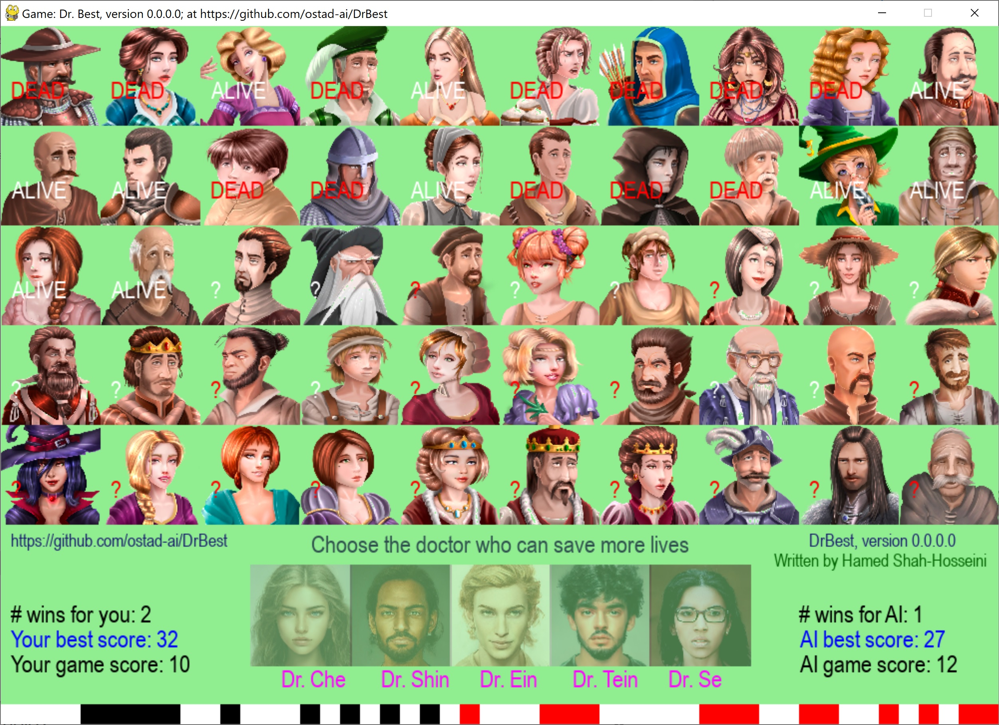

# DrBest
This is a 2D AI-based game in which you have to choose the best **doctor** to treat people infected with an unknown virus. In return, AI also plays the same role as yours. The one wins that has managed to keep more people alive. 
### First version: version 0.0.0.0
1. Use **Mouse** to move the cursor.
2. Use the mouse **Left-Button** to select the doctor over whom you have held the cursor.
3. The game has been augmented by an implementaiton of smoke effect.
## This archive includes the executable program: **drbest.exe**, which is suitable for **Windows 10** and over. You should click on the executable to run.
[Download the archive for win64](https://drive.google.com/file/d/1An3otNeICCSKJhEMJeFEcgY3gq8LA8R1/view?usp=sharing)
---
 *Figure 1: A snapshot of DrBest Game, version 0.0.0.0, while playing the game.*
---
